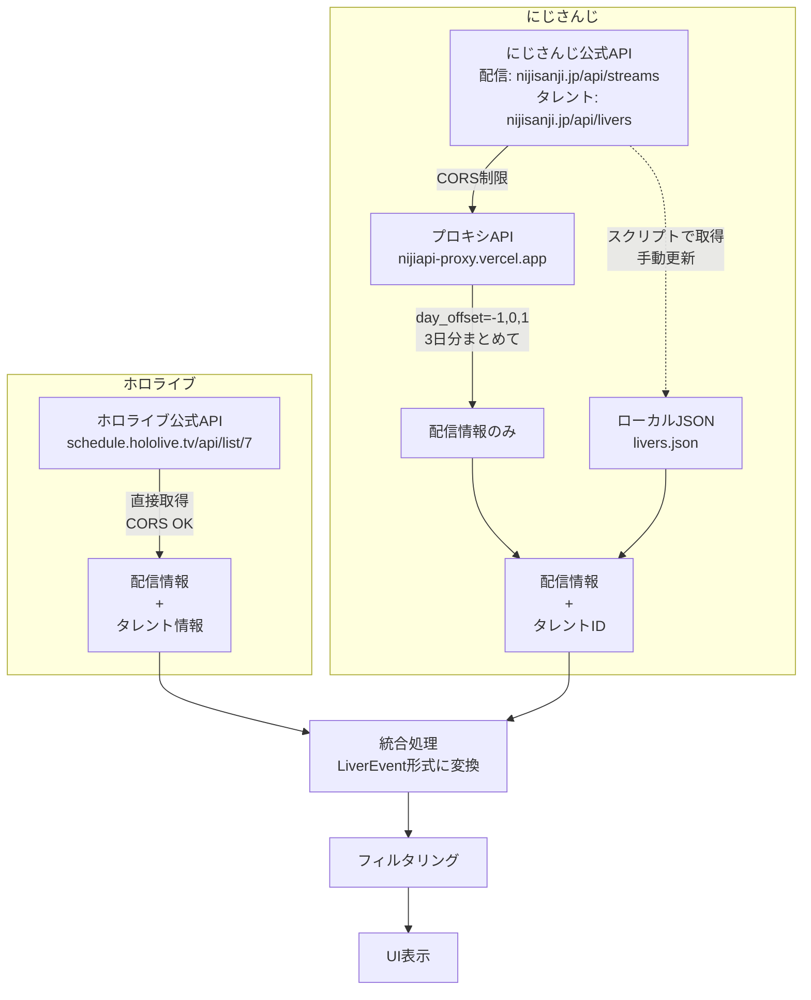
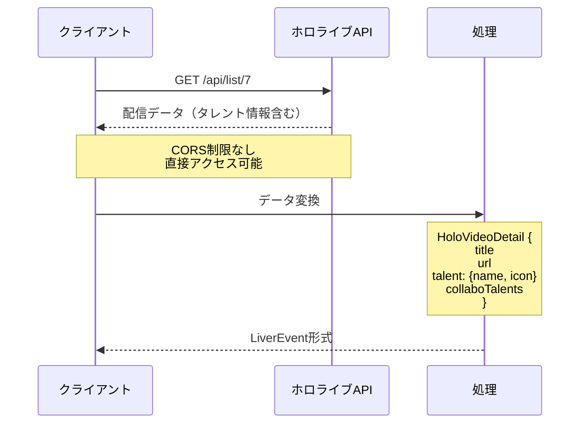
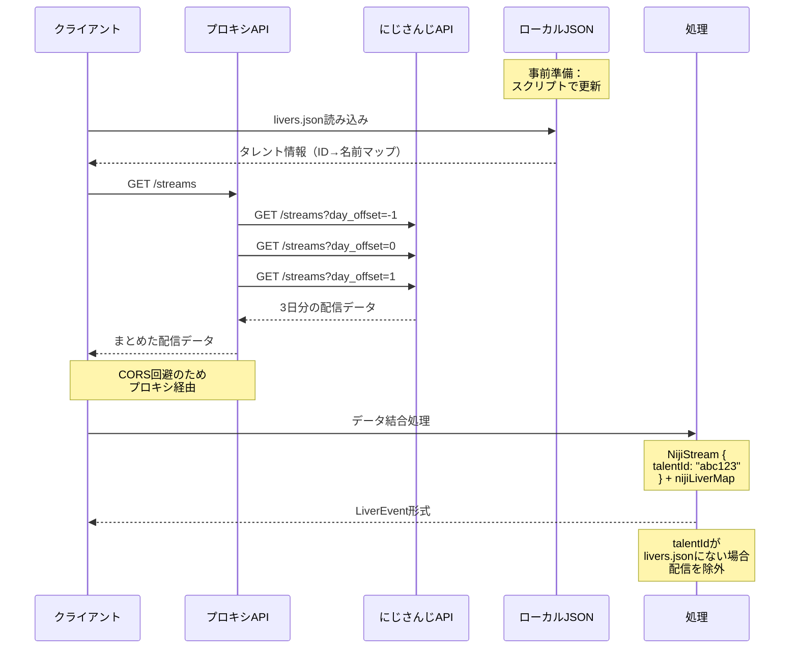
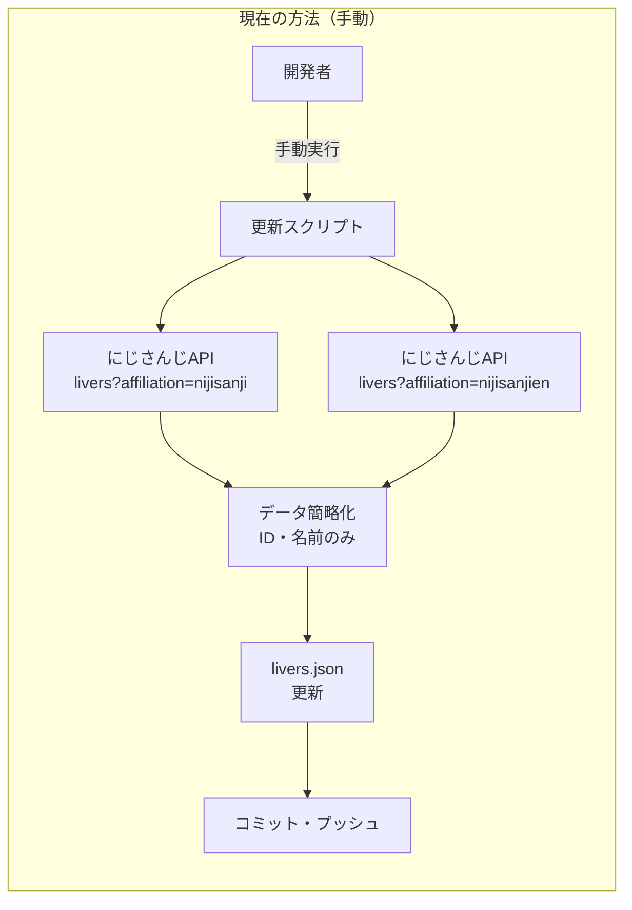
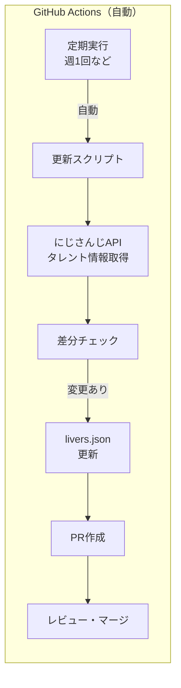
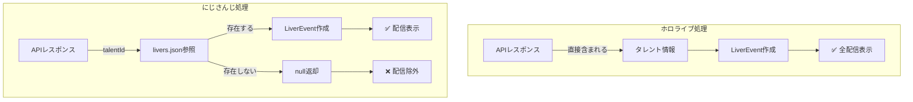
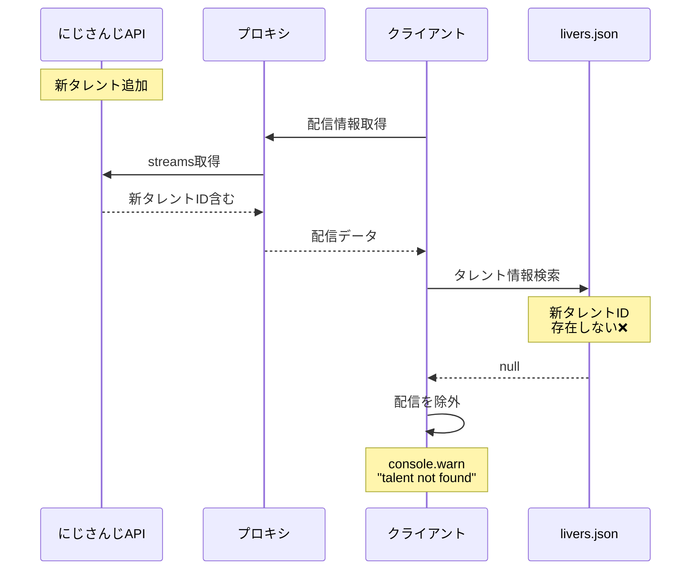
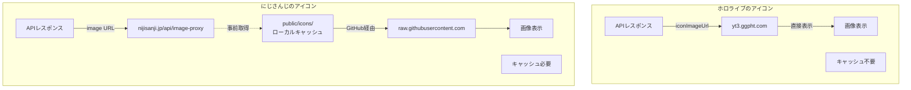

# API データフロー図

## 全体のデータフロー



## ホロライブのデータフロー



## にじさんじのデータフロー



## タレント情報の更新フロー



## 将来の自動更新フロー（提案）



## データ処理の比較



## 問題発生のフロー



## アイコン画像の処理



### アイコン処理の詳細

**ホロライブ**:

- APIレスポンスの `talent.iconImageUrl` を直接使用
- YouTubeのCDN（`yt3.ggpht.com`）から配信
- 画像サイズ: 幅88px
- CORS制限なし、キャッシュ不要

**にじさんじ**:

- 公式APIレスポンスの `images.head.url` にアイコンURL
- URLは `/api/image-proxy?url=...` 形式（署名付き）
- にじさんじ公式は `&w=200&fm=webp` でリサイズ・WebP形式指定
- 本アプリでは `&w=88&fm=webp` でホロライブと同じサイズに統一
- 事前に `public/icons/` にダウンロード・キャッシュ（88px WebP形式）
- `src/assets/icons.json` でタレント名とファイルパスをマッピング
- GitHub Raw経由（`raw.githubusercontent.com`）で配信
- 新規タレント追加時はアイコンもダウンロードが必要

```typescript
// src/utils/icons.ts（現在の実装）
const iconBase = "https://raw.githubusercontent.com/miyaoka/liver-streams/main/public/icons";
export function getChannelIcon(name: string) {
  const path = talentIcons[name]; // icons.jsonから取得
  return path ? `${iconBase}${path}` : `${iconBase}${defaultIcon}`;
}

// 将来の実装案：環境による切り替え
const iconBase = import.meta.env.DEV
  ? "/icons" // ローカル開発環境
  : "https://raw.githubusercontent.com/miyaoka/liver-streams/main/public/icons"; // 本番環境
```

### デプロイとアイコン配信戦略

**本アプリのデプロイ**:

- Vercelでホスティング: `https://liver-streams.vercel.app/`
- `public/icons/` は `/icons/` でアクセス可能

**Vercel無料プランの制限**:

- **帯域幅**: 100GB/月
- **エッジリクエスト**: 制限なし（静的ファイル）
- **サーバーレス関数の実行**: 100GB-時間/月
- 画像ファイル（WebP 88px）: 約3-5KB/枚
- 200人分 × 3-5KB = 600KB-1MB/回
- 問題点: 多数のユーザーが同時アクセスすると帯域幅を消費

**GitHub Raw の利点**:

- **リクエスト制限**:
  - 認証なし: 60リクエスト/時（API）
  - Raw コンテンツ: **制限なし**（CDN経由）
- `raw.githubusercontent.com` はCDN配信のため実質無制限
- キャッシュヘッダーが適切に設定される
- 世界中のエッジサーバーから配信

**配信パスの選択理由**:

```javascript
// 本番環境: GitHub Raw経由（推奨）
// - CDN経由で実質無制限
// - Vercelの帯域幅を消費しない
// - ブラウザキャッシュも効く
"https://raw.githubusercontent.com/miyaoka/liver-streams/main/public/icons/[filename]";

// ローカル開発環境: 直接配信（将来実装）
// - Viteの開発サーバーから直接配信
// - ネットワーク遅延なし
// - オフライン開発可能
"/icons/[filename]";

// Vercel経由（本番では避けるべき）
// - 200リクエスト × ユーザー数 = 大量のトラフィック
// - 無料プランの帯域幅を消費
"https://liver-streams.vercel.app/icons/[filename]";
```

**環境別の配信戦略（将来実装）**:
| 環境 | 配信元 | メリット |
|------|--------|----------|
| ローカル開発 | `/icons/` | 高速、オフライン可能 |
| 本番（Vercel） | GitHub Raw | 帯域幅節約、無制限 |
| プレビュー | GitHub Raw | 本番と同じ挙動 |

## まとめ

### 主な違い

| 項目               | ホロライブ                  | にじさんじ                            |
| ------------------ | --------------------------- | ------------------------------------- |
| タレント情報源     | APIレスポンス内             | 静的ファイル（livers.json）           |
| アイコン画像       | yt3.ggpht.com（88px、直接） | public/icons（88px WebP、キャッシュ） |
| CORS制限           | なし                        | あり（プロキシ必要）                  |
| 新規タレント対応   | 自動                        | 手動更新必要                          |
| データ取得         | 1回のAPI呼び出し            | 配信API + 事前のタレント情報          |
| エラーハンドリング | 不要                        | talentId不在で除外                    |

### 現在の課題

- にじさんじの新規タレントは `livers.json` を更新するまで表示されない
- タレント情報の更新は手動で行う必要がある
- アイコン画像も事前にダウンロード・キャッシュが必要
- プロキシAPIはCORS回避のためだけに使用（タレント情報は提供しない）

### 設計上の工夫

- **リクエスト最適化**: GitHub RawをCDNとして活用し、Vercelの帯域幅制限を回避
- **画像最適化**: 88px WebP形式で統一し、ファイルサイズを最小化（3-5KB/枚）
- **キャッシュ戦略**: 静的ファイルとして事前キャッシュすることで、実行時の負荷を軽減
- **コスト最適化**: GitHub Rawの無制限CDN配信を活用し、Vercel無料プランでも運用可能

### まとめ：配信戦略の妥当性

**Vercel経由の問題点**:

- 200人分のアイコン = 200リクエスト/ユーザー
- 1000ユーザー/日 × 1MB = 1GB/日 = 30GB/月
- 無料プラン（100GB/月）の30%を消費

**GitHub Raw経由の利点**:

- ✅ リクエスト数: 実質無制限（CDN配信）
- ✅ 帯域幅: Vercelの制限に影響しない
- ✅ パフォーマンス: 世界中のCDNエッジから配信
- ✅ コスト: 完全無料

**結論**: GitHub Rawからの配信は技術的・経済的に最適な選択
