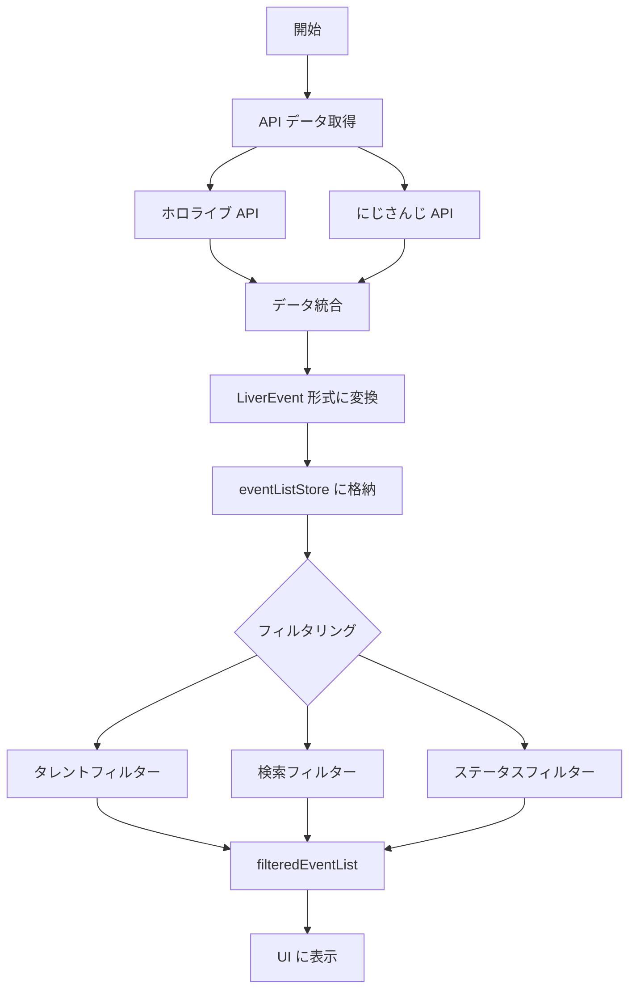

# データフローとフィルタリング処理

## 概要

liver-streams アプリケーションにおける配信データの取得から表示、フィルタリング処理までの流れを説明します。

## データフロー図



## データ取得処理

### API エンドポイント

配信データは2つのソースから取得されます：

#### ホロライブ

- **エンドポイント**: `https://schedule.hololive.tv/api/list/7`
- **取得範囲**: 前日から翌日まで（3日分）
- **CORS**: 制限なし（クライアントから直接取得可能）

#### にじさんじ

- **元API**: `https://www.nijisanji.jp/api/streams?day_offset={offset}`
  - `day_offset`: -3〜3まで指定可能（-1=前日、0=当日、1=翌日）
- **プロキシAPI**: `https://nijiapi-proxy.vercel.app/api/streams`
  - CORS制限を回避するためのプロキシ
  - -1、0、1の3日分のデータをまとめてキャッシュして返す
  - ホロライブと同じ範囲（前日〜翌日）に統一

### データ取得の流れ

#### 1. 初期データ取得 (`src/services/api.ts`)

```typescript
// fetchLiverEventList 関数で両方のAPIを並列取得
const [holoEvents, nijiStreams] = await Promise.all([fetchHoloEventList(), fetchNijiStreamList()]);
```

#### 2. データ変換

取得したデータは統一フォーマット `LiverEvent` に変換されます：

```typescript
interface LiverEvent {
  id: string; // 一意のID
  affilication: "hololive" | "nijisanji";
  startAt: Date; // 配信開始時刻
  title: string; // 配信タイトル
  url: string; // 配信URL
  thumbnail: string; // サムネイル画像
  endAt: Date | null; // 配信終了時刻
  isLive: boolean; // 配信中フラグ
  talent: LiverTalent; // メインタレント情報
  collaboTalents: LiverTalent[]; // コラボタレント情報
  hashtagList: string[]; // ハッシュタグリスト
  hashtagSet: Set<string>; // ハッシュタグセット（検索用）
  collaboTalentSet: Set<string>; // コラボタレントセット（検索用）
  keywordList: string[]; // キーワードリスト
}
```

## フィルタリング処理

### フィルタリングの種類

アプリケーションでは3種類のフィルタリングが適用可能です：

#### 1. タレントフィルター

特定のライバー（配信者）で絞り込む機能です。

**処理場所**: `src/lib/search.ts`

```typescript
// タレントフィルターの適用
function getTalentFilterMapApplyedList({
  filterMap,
  liverEventList,
}: {
  filterMap: Map<string, boolean>; // 選択されたタレント名のMap
  liverEventList: LiverEvent[];
}) {
  // フィルタなしの場合は全件返却
  if (filterMap.size === 0) return liverEventList;

  // タレント名かコラボタレント名がフィルターに含まれるイベントのみ表示
  return liverEventList.filter((liverEvent) => talentFilter({ liverEvent, filterMap }));
}
```

**フィルタリング条件**:

- メインタレントが選択されている
- または、コラボタレントに選択されたタレントが含まれる

#### 2. 検索フィルター

キーワード検索による絞り込み機能です。

**処理場所**: `src/lib/search.ts`

```typescript
// 検索フィルターの適用
if (searchRegExp) {
  result = result.filter((liverEvent) => {
    return (
      searchRegExp.test(liverEvent.title) || // タイトル検索
      searchRegExp.test(liverEvent.talent.name) || // タレント名検索
      liverEvent.collaboTalents.some((collaborator) => {
        return searchRegExp.test(collaborator.name); // コラボタレント名検索
      })
    );
  });
}
```

**検索対象**:

- 配信タイトル
- メインタレント名
- コラボタレント名

**検索オプション**:

- AND 検索: スペース区切りで複数キーワード
- OR 検索: `or` または `|` で区切る
- ハッシュタグ検索: `#` で始まるキーワード

#### 3. ステータスフィルター

配信状態による絞り込み機能です。

**処理場所**: `src/lib/search.ts`

```typescript
// ライブ中のみ表示
if (status?.includes("live")) {
  result = result.filter((liverEvent) => liverEvent.isLive);
}
```

### フィルタリング処理の統合

すべてのフィルタリングは `getFilteredEventList` 関数で統合的に処理されます：

```typescript
export function getFilteredEventList({
  liverEventList,
  filterMap,
  searchQuery,
}: {
  liverEventList: LiverEvent[];
  filterMap: Map<string, boolean>;
  searchQuery: SearchQuery;
}): LiverEvent[] {
  let result = liverEventList;

  // 1. ステータスフィルター
  if (status?.includes("live")) {
    result = result.filter((liverEvent) => liverEvent.isLive);
  }

  // 2. タレントフィルター
  result = talent
    ? getTalentFocusedList({ talent, liverEventList: result })
    : getTalentFilterMapApplyedList({ filterMap, liverEventList: result });

  // 3. ハッシュタグフィルター
  if (hashtagList.length > 0) {
    result = result.filter((liverEvent) => {
      return hashtagList.every((hashtag) => {
        return liverEvent.hashtagSet.has(hashtag.toLowerCase());
      });
    });
  }

  // 4. 検索フィルター
  if (searchRegExp) {
    result = result.filter((liverEvent) => {
      // タイトル、タレント名、コラボタレント名で検索
    });
  }

  return result;
}
```

## ストア管理

### eventListStore

配信イベントリストの状態管理を行います。

**主要な computed プロパティ**:

```typescript
const filteredEventList = computed(() => {
  if (!liverEventList.value) return [];
  return getFilteredEventList({
    liverEventList: liverEventList.value,
    filterMap: storageStore.talentFilterMap,
    searchQuery: searchStore.searchQuery,
  });
});
```

### storageStore

フィルター設定の永続化を担当します。

- `talentFilterMap`: 選択されたタレントのMap
- `talentFilterEnabled`: フィルター有効/無効の状態

### searchStore

検索条件の管理を行います。

- `searchQuery`: 検索クエリオブジェクト
- `searchString`: 検索文字列

## UI コンポーネント

### ChannelFilter.vue

タレント選択用のUIコンポーネントです。

**機能**:

- グループ（ホロライブ/にじさんじ）ごとのタレント一覧表示
- チェックボックスによる複数選択
- 選択数の表示
- リセット機能

### SearchBar.vue

検索入力用のUIコンポーネントです。

**機能**:

- キーワード入力
- ライブ中フィルターのトグル
- 検索クエリのパース

## パフォーマンス最適化

### 計算結果のキャッシュ

Vue の `computed` を使用して、依存データが変更されるまで計算結果をキャッシュ：

```typescript
const filteredEventList = computed(() => {
  // 依存: liverEventList, talentFilterMap, searchQuery
  // これらが変更されない限り再計算されない
});
```

### Set を使用した高速検索

ハッシュタグやコラボタレントの検索には Set を使用：

```typescript
hashtagSet: new Set(hashtagList.map((h) => h.toLowerCase()));
collaboTalentSet: new Set(collaboTalents.map((t) => t.name));
```

### 並列データ取得

Promise.all を使用して API 呼び出しを並列化：

```typescript
const [holoEvents, nijiStreams] = await Promise.all([fetchHoloEventList(), fetchNijiStreamList()]);
```

## データ更新サイクル

アプリケーションは定期的にデータを更新します：

1. **初回ロード**: アプリケーション起動時
2. **定期更新**: 1分ごとに最新データを取得
3. **新着通知**: 新規配信が追加された場合に通知

更新時の処理：

1. API からデータ取得
2. 新着イベントの検出
3. ブックマークイベントの処理
4. フィルタリングの再適用
5. UI の更新

## 既知の問題

### にじさんじの新規タレント表示問題

現在、にじさんじのタレント情報は静的ファイル (`src/services/nijisanji/sample3/livers.json`) から読み込まれています。
そのため、以下の問題が発生します：

**問題の詳細**:

1. APIから新しいタレントの配信情報が取得されても表示されない
2. `getNijiEvents` 関数（`src/services/api.ts:144-149`）で、`nijiLiverMap` に存在しないタレントIDは除外される
3. コンソールに `talent not found: [タレントID]` の警告が出力される

**該当コード**:

```typescript
// src/services/api.ts
function getTalent(id: string) {
  const talent = nijiLiverMap[id];
  if (!talent) {
    console.warn(`talent not found: ${id}`);
    return null; // ← ここで null を返すと配信が除外される
  }
  // ...
}
```

**解決方法**:

- `livers.json` を定期的に更新する
- または、動的にタレント情報を取得するAPIエンドポイントを使用する

## まとめ

liver-streams のデータフローとフィルタリング処理は、以下の特徴を持ちます：

- **統一データ形式**: 異なるAPIからのデータを統一フォーマットに変換
- **多層フィルタリング**: タレント、検索、ステータスの3種類のフィルター
- **リアクティブな更新**: Vue の computed によるリアクティブな状態管理
- **パフォーマンス最適化**: キャッシュ、Set、並列処理による最適化
- **永続化**: フィルター設定の保存と復元
