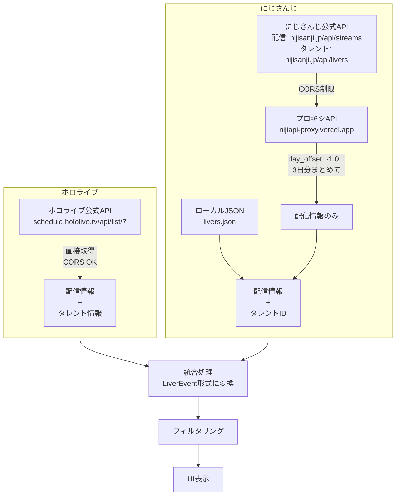
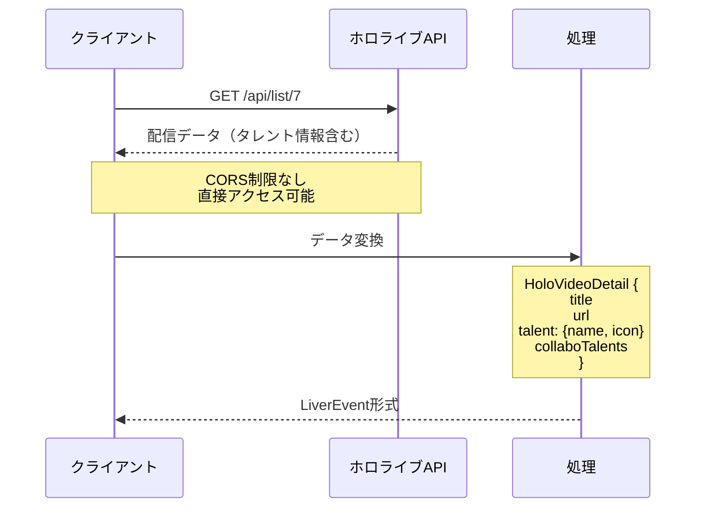
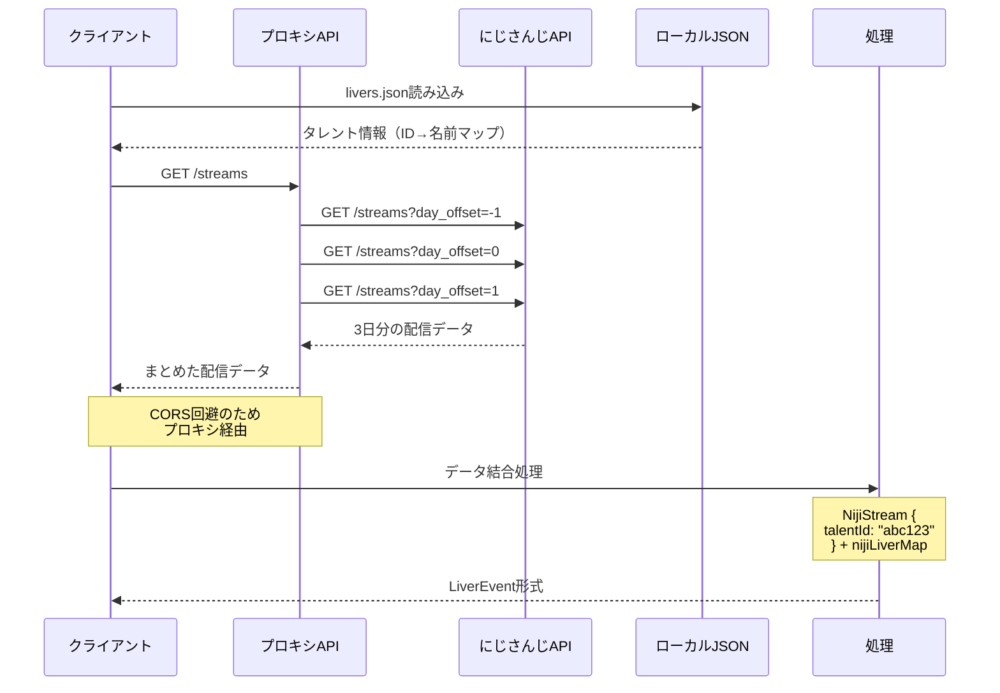
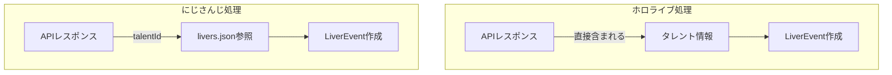

# 外部 API とデータ取得

## 全体のデータフロー

## ホロライブのデータフロー

## にじさんじのデータフロー

## データ処理の比較

## まとめ

| 項目           | ホロライブ       | にじさんじ                   |
| -------------- | ---------------- | ---------------------------- |
| タレント情報源 | APIレスポンス内  | 静的ファイル（livers.json）  |
| CORS制限       | なし             | あり（プロキシ必要）         |
| データ取得     | 1回のAPI呼び出し | 配信API + 事前のタレント情報 |

> [!NOTE]
> タレント情報と画像の管理については [talent-auto-update.md](./talent-auto-update.md) を参照。
