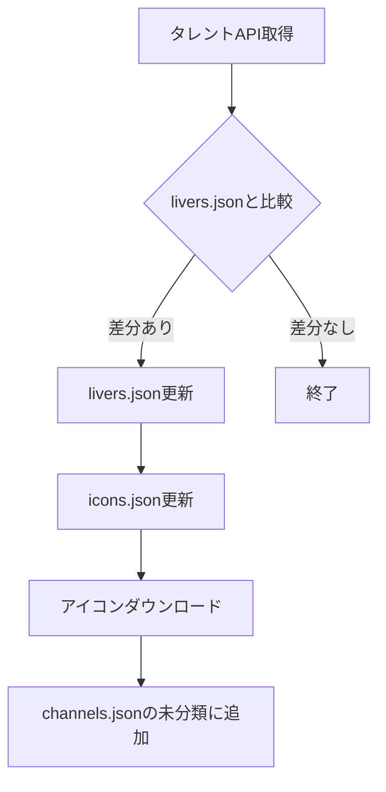
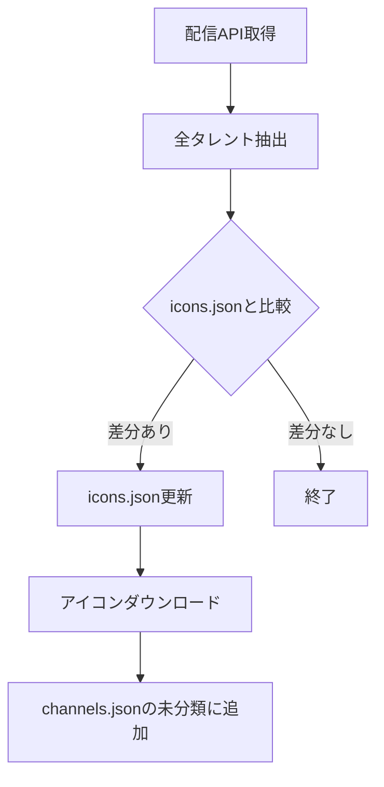

# タレント自動更新

新規タレントを自動検出し、データファイルとアイコン画像を更新する仕組み。

## アーキテクチャ

### ファイル配置

```
services/
├── hololive/
│   ├── assets/icons/         # アイコン画像
│   ├── data/
│   │   ├── icons.json        # name → パス
│   │   └── channels.json     # フィルターUI用階層データ
│   └── scripts/
│       └── update-talents.ts # 更新スクリプト
└── nijisanji/
    ├── assets/icons/         # アイコン画像
    ├── data/
    │   ├── icons.json        # name → パス
    │   ├── livers.json       # id → name
    │   └── channels.json     # フィルターUI用階層データ
    └── scripts/
        └── update-talents.ts # 更新スクリプト

packages/ui/public/icons/
├── hololive -> ../../../../services/hololive/assets/icons  # シンボリックリンク
└── nijisanji -> ../../../../services/nijisanji/assets/icons
```

### 画像パスの解決

```
開発時（dev）: localIconBaseUrl → /icons/hololive/xxx.jpg
本番（build）: GitHub raw URL → https://raw.githubusercontent.com/.../services/hololive/assets/icons/xxx.jpg
```

## API エンドポイント

| サービス   | 用途               | URL                                                                           |
| ---------- | ------------------ | ----------------------------------------------------------------------------- |
| ホロライブ | 配信スケジュール   | `https://schedule.hololive.tv/api/list/7`                                     |
| にじさんじ | タレント一覧（JP） | `https://www.nijisanji.jp/api/livers?affiliation=nijisanji&includeAll=true`   |
| にじさんじ | タレント一覧（EN） | `https://www.nijisanji.jp/api/livers?affiliation=nijisanjien&includeAll=true` |

## 更新フロー

### にじさんじ



### ホロライブ



## スクリプト実行

```bash
# にじさんじ
pnpm --filter @liver-streams/services-nijisanji update-talents

# ホロライブ
pnpm --filter @liver-streams/services-hololive update-talents
```

## GitHub Actions

- **スケジュール**: 毎日 JST 00:10（UTC 15:10）
- **手動実行**: workflow_dispatch
- **処理内容**: 両スクリプトを実行し、差分があればPR作成

## 新規タレントの扱い

- 検出された新規タレントは `channels.json` の「未分類」グループに追加される
- 適切なユニット・グループへの移動は手動で行う
- 「未分類」グループが空になったら削除可能
