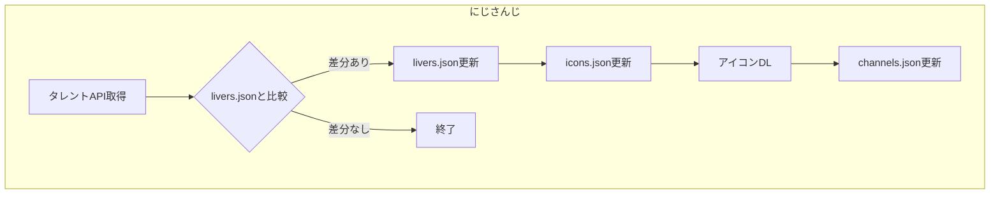
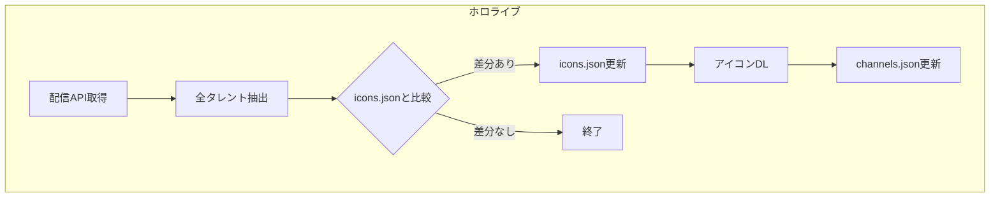

# タレント情報と画像の管理

## 画像管理

### 設計方針

- **画像の実体**: 各データソースパッケージ（`packages/*/assets/icons/`）で管理
- **公開の責務**: web アプリ（`apps/web`）が担う

この分離により、タレント情報と画像をパッケージ単位で一元管理しつつ、公開は web に任せる構成になっている。

### ファイル配置

```
packages/
├── hololive/
│   ├── assets/icons/         # アイコン画像（実体）
│   ├── data/
│   │   ├── icons.json        # name → パス
│   │   └── channels.json     # フィルターUI用階層データ
│   └── scripts/
│       └── update-talents.ts
└── nijisanji/
    ├── assets/icons/         # アイコン画像（実体）
    ├── data/
    │   ├── icons.json        # name → パス
    │   ├── livers.json       # id → name
    │   └── channels.json     # フィルターUI用階層データ
    └── scripts/
        └── update-talents.ts

apps/web/public/icons/
├── hololive -> ../../../../packages/hololive/assets/icons   # symlink
└── nijisanji -> ../../../../packages/nijisanji/assets/icons # symlink
```

### 開発時と本番時の画像パス

| 環境          | パス解決                                 | 理由                                     |
| ------------- | ---------------------------------------- | ---------------------------------------- |
| 開発（dev）   | `/icons/hololive/xxx.jpg`（symlink経由） | Vite dev server がローカルファイルを配信 |
| 本番（build） | GitHub raw URL                           | ホスティング先のアクセス制限回避         |

本番で GitHub raw URL を使う理由:

- 数百人のタレント画像を一度に読み込むと、ホスティングサービス（Vercel等）のアクセス回数制限に抵触する可能性がある
- GitHub の CDN に負荷を分散させる

> [!NOTE]
> build 時に symlink は実体として dist に含まれるが、実際には使用されない。

## サービス間のデータ構造の違い

### にじさんじ

タレント一覧 API があり、構造的にデータをリンクさせる:

```
livers.json (id → name) → icons.json (name → path)
                        → channels.json (グループ階層)
```

### ホロライブ

タレント一覧 API がなく、配信スケジュール API のイベント情報にタレント情報が含まれる:

```
配信API → イベントごとに talent { name, iconImageUrl } を持つ
        → icons.json に name が未登録なら新規タレントとして検出
```

## 自動更新

### API エンドポイント

| サービス   | 用途               | URL                                                                           |
| ---------- | ------------------ | ----------------------------------------------------------------------------- |
| ホロライブ | 配信スケジュール   | `https://schedule.hololive.tv/api/list/7`                                     |
| にじさんじ | タレント一覧（JP） | `https://www.nijisanji.jp/api/livers?affiliation=nijisanji&includeAll=true`   |
| にじさんじ | タレント一覧（EN） | `https://www.nijisanji.jp/api/livers?affiliation=nijisanjien&includeAll=true` |

### 更新フロー





### スクリプト実行

```bash
# にじさんじ
pnpm --filter @liver-streams/nijisanji update-talents

# ホロライブ
pnpm --filter @liver-streams/hololive update-talents
```

### GitHub Actions

- **スケジュール**: 毎日 JST 00:10（UTC 15:10）
- **手動実行**: workflow_dispatch
- **処理内容**: 両スクリプトを実行し、差分があれば PR 作成

### 新規タレントの扱い

- 検出された新規タレントは `channels.json` の「未分類」グループに追加される
- 適切なユニット・グループへの移動は手動で行う
- 「未分類」グループが空になったら削除可能
