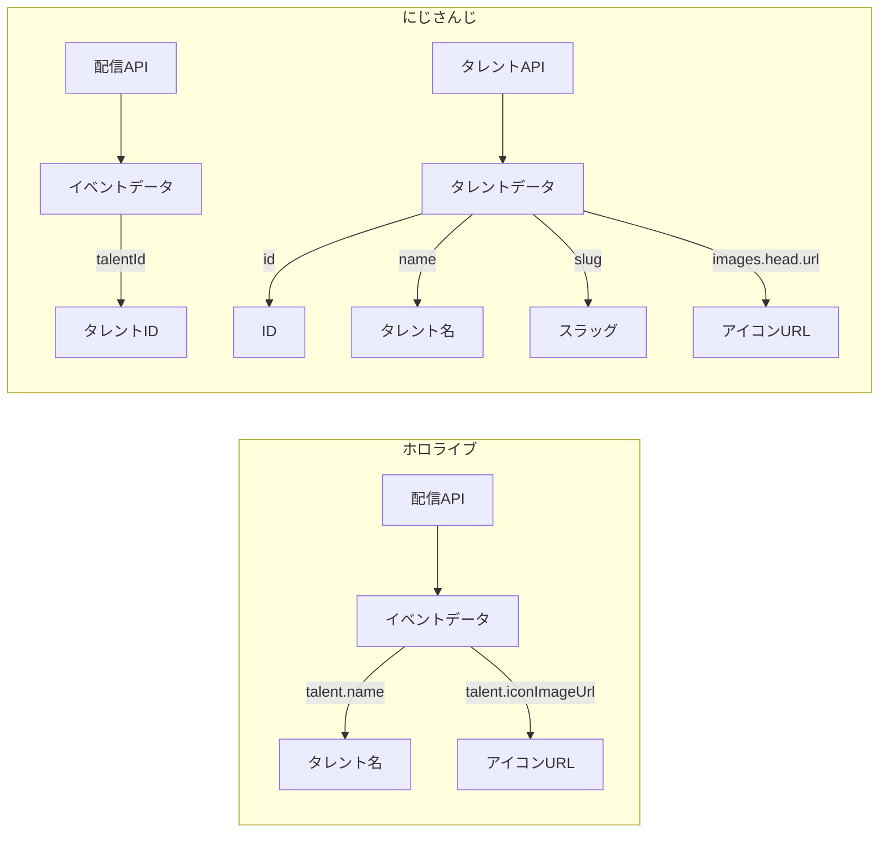
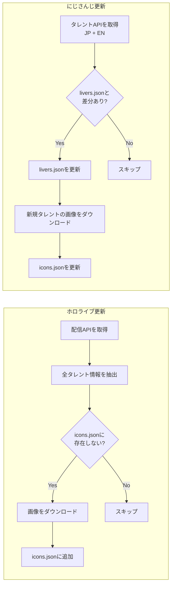

# タレントデータ更新

タレントデータの取得・更新フローを定義する。

## データ構造



## API エンドポイント

| サービス   | 種別         | URL                                                                           |
| ---------- | ------------ | ----------------------------------------------------------------------------- |
| ホロライブ | 配信         | `https://schedule.hololive.tv/api/list/7`                                     |
| にじさんじ | 配信         | `https://nijiapi-proxy.vercel.app/api/streams`                                |
| にじさんじ | タレント(JP) | `https://www.nijisanji.jp/api/livers?affiliation=nijisanji&includeAll=true`   |
| にじさんじ | タレント(EN) | `https://www.nijisanji.jp/api/livers?affiliation=nijisanjien&includeAll=true` |

## ローカルデータファイル

```
services/
├── hololive/data/
│   └── icons.json          # name → /hololive/{name}.jpg
└── nijisanji/data/
    ├── icons.json          # name → /nijisanji/{slug}.webp
    └── livers.json         # id → { name }

packages/ui/public/icons/
├── hololive/               # {name}.jpg
└── nijisanji/              # {slug}.webp
```

## 日次更新フロー



## データ変換

### ホロライブ

```
イベントAPI → icons.json
─────────────────────────
talent.name         → key
talent.iconImageUrl → ダウンロード → /hololive/{name}.jpg
```

### にじさんじ

```
タレントAPI → livers.json
─────────────────────────
id   → key
name → value.name

タレントAPI → icons.json
─────────────────────────
name            → key
slug            → /nijisanji/{slug}.webp
images.head.url → ダウンロード → /nijisanji/{slug}.webp
```

## 更新トリガー

| サービス   | トリガー                       | 理由                  |
| ---------- | ------------------------------ | --------------------- |
| ホロライブ | イベントに未知のタレントが出現 | タレント専用APIがない |
| にじさんじ | タレントAPIに変更あり          | IDで紐付けが必要      |
